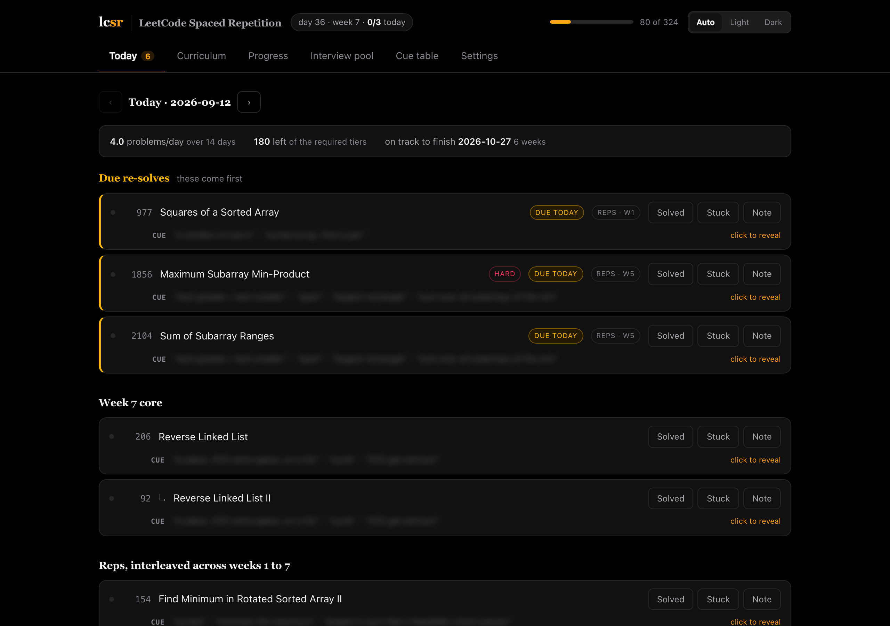
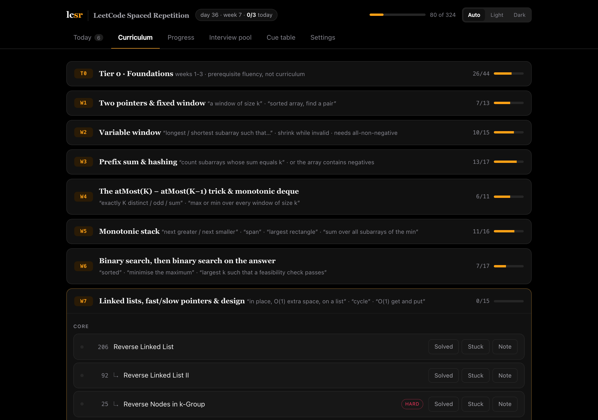
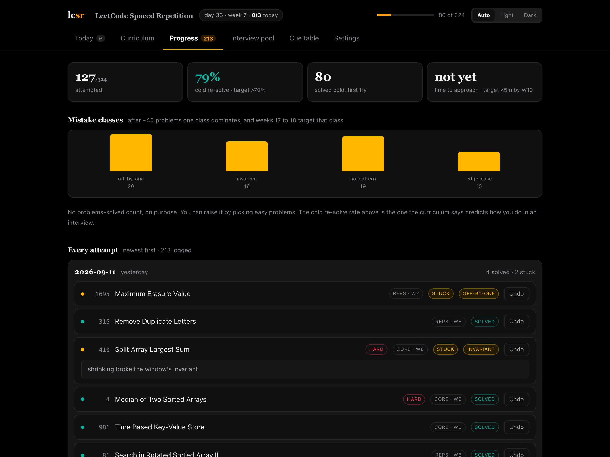
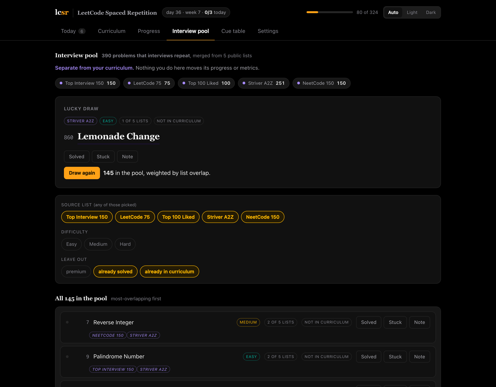
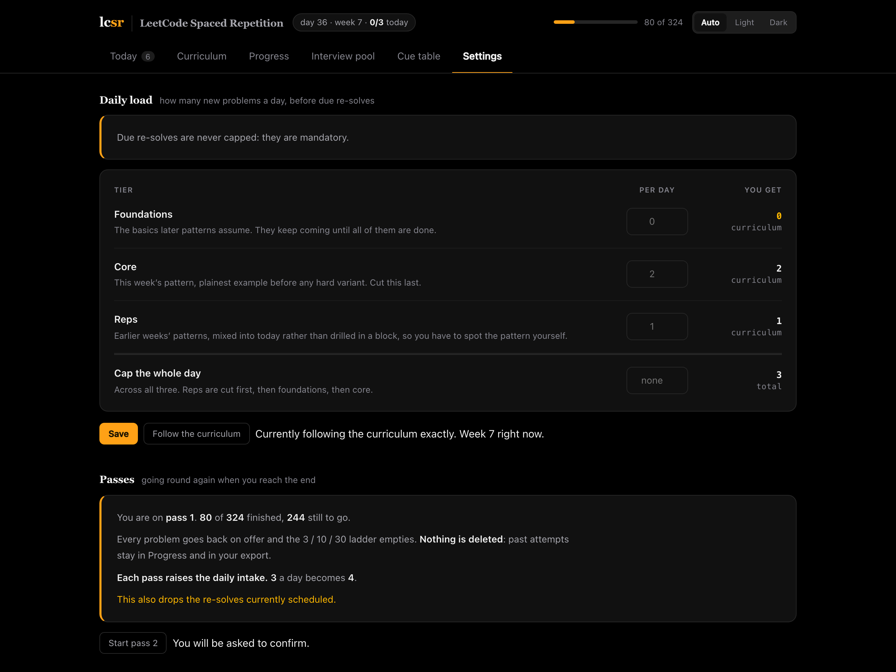

# lcsr: LeetCode Spaced Repetition

**A spaced repetition system for LeetCode and DSA interview prep.**

**Miss a problem and it comes back in 3 days, then 10, then 30. Solve it cold and
it never comes back at all.** Fail it again at any rung and you drop to the
bottom, because the point is to re-earn the spacing, not to resume it.

That schedule runs over 324 problems in a fixed order, taken from an 18-week
data structures and algorithms curriculum, plus its 20-row pattern cue table.

Self-hosted, single file of state, no account, no tracking, no dependencies.
Python CLI plus a local web UI, with light and pitch-dark themes.

It does not invent a study method. The curriculum has one; this makes following
it cost nothing.

**Why spaced repetition for coding interviews.** Solving a problem once and
moving on feels productive and does not last. Spacing beats massed practice
across 839 measured comparisons, and expanding intervals beat fixed ones
([the evidence](docs/evidence.md)). 3 / 10 / 30 is an expanding schedule.



<table>
<tr>
<td width="50%"><a href="docs/screenshots/curriculum.png"></a><br><sub><b>Curriculum.</b> All 324 problems in the order they are taught, week by week.</sub></td>
<td width="50%"><a href="docs/screenshots/progress.png"></a><br><sub><b>Progress.</b> The three metrics, the mistake histogram, and every attempt.</sub></td>
</tr>
<tr>
<td width="50%"><a href="docs/screenshots/pool.png"></a><br><sub><b>Interview pool.</b> 390 problems from five lists, with a weighted draw.</sub></td>
<td width="50%"><a href="docs/screenshots/settings.png"></a><br><sub><b>Settings.</b> The daily load, repeat passes, and export.</sub></td>
</tr>
</table>

### The order is the other half

A list of problems is not a curriculum. These 324 run in a deliberate sequence:
the plainest example of a pattern always lands before any hard variant of it, so
every problem has something to stand on.

Where the source curriculum broke its own rule, this fixes it: it taught Max
Product Subarray without max-sum Kadane first. Ten problems were added to close
gaps like that, each slotted into its real place rather than appended, because a
base exemplar arriving after its own hard variant teaches backwards.

Reps are interleaved on purpose. Blocked practice's errors are mostly
strategy-selection errors, picking a method that belonged to a different problem
type, because the heading already told you which one to use. Interviews do not
come with headings.

### What it does

- **Spaced repetition / SRS scheduling**, as above, over every problem you fail.
- **An 18-week DSA curriculum**, 324 problems across foundations, core, reps and
  stretch tiers.
- **A cue table**: what the problem *says*, mapped to the pattern to reach for.
  Self-testable, answers hidden by default.
- **An interview pool** of 390 problems merged from five well-known lists
  (below), with a weighted random draw.
- **The three metrics the curriculum names**: cold re-solve rate at 30 days,
  time to correct approach, and a mistake-class histogram. No streaks and no
  problems-solved counter, on purpose.
- **A configurable daily load**, if the curriculum's own pace is wrong for you.
- **Repeat passes.** Finish the whole thing and start again: every problem goes
  back on offer, the ladder empties, and the daily intake rises by one. Nothing
  is deleted, and the old attempts stay in your history and your export.
- **Export**, to CSV or the raw log, so the record is never trapped in here.

### Keywords

leetcode, spaced repetition, SRS, DSA, data structures and algorithms, coding
interview preparation, technical interview prep, algorithm practice, NeetCode
150, Blind 75, LeetCode 75, Top Interview 150, Top 100 Liked, Striver A2Z,
SDE sheet, FAANG interview, active recall, retrieval practice, interleaving,
study planner, problem tracker, review scheduler, anki for leetcode, self-hosted,
python, cli, local-first, no-tracking

## Install

```bash
/opt/homebrew/bin/python3.13 -m venv .venv && .venv/bin/pip install -e .
```

Python 3.10+ (system Python is 3.9). No dependencies.

To get `lcsr` on your PATH:

```bash
ln -s ~/leetcode-srs/.venv/bin/lcsr /opt/homebrew/bin/lcsr
```

## Use

```bash
lcsr up            # start the UI in the background and open it
lcsr status        # is it running?
lcsr down          # stop it
```

`lcsr up` is idempotent and detaches into its own session, so it survives the
terminal that launched it. Liveness is a connection to the port, not a pidfile:
a pidfile outlives a crash and pids get reused.

`lcsr serve` still runs it in the foreground if you want the logs; background
output goes to `~/.lcsr/server.log`.

The page shows due re-solves first, then today's new problems. Each row links to
LeetCode, and marks **Solved** or **Stuck**; stuck opens a mistake class and a
note field. Nothing is stored in the browser; every action appends to the same
log the CLI reads.

### Adding problems

In the UI, "Add a problem" at the bottom. Or:

```bash
lcsr add 1768 "Merge Strings Alternately" --block Warmup --cue "two strings, alternate"
```

Additions go to `~/.lcsr/custom.json`, kept separate from the packaged
curriculum so upgrades never overwrite them, and appear under "Added". A custom
entry reusing a packaged id overrides it, which is how you re-week or retag a
problem without editing packaged data.

### CLI

```bash
lcsr today                       # due re-solves first, then today's new problems
lcsr show 42                     # the cue and the link, but not the pattern name
lcsr log 42                      # solved it cold
lcsr log 42 --stuck --mistake invariant
lcsr log 1 217 242 --date yesterday
lcsr amend 15 --stuck --mistake no-pattern   # it was not actually solved
lcsr undo 209                    # retract the most recent attempt
lcsr stats                       # the three metrics the curriculum names
lcsr cues                        # self-test the cue table; --answers to check
lcsr week 5                      # one week's blocks, with progress
lcsr config                      # show the daily load
lcsr config --core 3 --total 5   # change it; `--core default` clears one
lcsr sprint                      # start another pass over the curriculum
lcsr export --out progress.csv   # every problem, every attempt
```

Mistake classes: `off-by-one`, `invariant`, `edge-case`, `no-pattern`.

### The daily load

By default you get the curriculum's own load: roughly 4 to 5 new problems a day
in weeks 1 to 3, 3 a day after, plus whatever re-solves fall due. Due re-solves
are never capped.

Change any of it in **Settings**, or from the CLI:

```bash
lcsr config --foundations 1 --core 2   # per tier
lcsr config --total 4                  # or cap the whole day
lcsr config --reset                    # back to the curriculum's own load
```

Unset follows the curriculum; `0` stops that tier entirely, which is not the
same thing. When a cap bites, reps are cut first, then foundations, then core.

### Going round again

When the curriculum is finished, start another pass:

```bash
lcsr sprint          # refuses unless everything is done; --force overrides
```

Every problem goes back on offer, the ladder empties, and the daily intake rises
by one. **Nothing is deleted**: a pass is one more line in the append-only log,
so every attempt stays in Progress and in your export. `undo` and `amend` will
not reach back into a finished pass.

### Export

```bash
lcsr export                      # CSV to stdout
lcsr export --out progress.csv   # or to a file
lcsr export --format jsonl       # the raw append-only log
```

One row per problem, all 324, then a column group per attempt: date, outcome,
mistake class, pass and note. Both are in **Settings** in the UI too.

## How it works

`~/.lcsr/log.jsonl` is append-only and is the only record. Undo and amend append a
retraction rather than deleting a line, so a mis-logged attempt is recoverable
and the record of what happened is never rewritten underneath you. An amend
keeps the original attempt's date: correcting a button-press is not the same as
working the problem again today, and re-logging would shift the due date and
consume the day's quota. Due dates, boxes and
every metric are recomputed from it on each run, so nothing can drift out of
sync and the scheduling rule can change later without invalidating history.

`lcsr serve` binds to loopback only and has no auth. It is a local tool.

Scheduling is `src/lcsr/schedule.py`: one pure function, with an exhaustive
truth table over all 8 states in `tests/test_schedule.py`.

No streak counter and no problems-solved count. You can raise problems-solved by
picking easy problems. The cold re-solve rate is the one that predicts.

## The interview pool

A separate **Interview pool** tab: 390 unique problems merged from five public
lists, with a weighted lucky draw.

| List | Problems |
|---|---|
| [NeetCode 150](https://neetcode.io/practice) | 150 |
| [Top Interview 150](https://leetcode.com/studyplan/top-interview-150/) | 150 |
| [Top 100 Liked](https://leetcode.com/studyplan/top-100-liked/) | 100 |
| [LeetCode 75](https://leetcode.com/studyplan/leetcode-75/) | 75 |
| [Striver A2Z](https://takeuforward.org/strivers-a2z-dsa-course/strivers-a2z-dsa-course-sheet-2/) | 251 |

The draw is weighted by how many lists a problem appears on, so the eight that
all five agree about come up most and the 212 that only one list carries come up
least.

It is deliberately *not* merged into the curriculum and changes no metric. The
only crossing point is read-only: each row says whether it is already in your
curriculum and whether you have logged it.

Deduplication is by LeetCode frontend id, the only stable key (titles repeat,
slugs change). 749 raw entries collapse to 390, because the lists overlap
heavily and A2Z files 18 problems under two to four topics each (274 entries for
251 problems).

```bash
python tools/build_frequent.py     # refetch and rebuild the pool
```

## Regenerating the curriculum

```bash
python tools/parse_curriculum.py ~/Desktop/DSA-Curriculum-18-Week.pdf
```

Asserts the tier counts still match the figures the PDF states for itself
(42/142/113/17), so a layout change in a future edition fails loudly instead of
silently producing a short list.

## Docs

- [`docs/evidence.md`](docs/evidence.md): the literature review this started from
- [`docs/design.md`](docs/design.md): what was built and what was dropped

---

Made with love by [Swapnil](https://github.com/Swapnil-jain)
· [GitHub](https://github.com/Swapnil-jain/leetcode-srs)
